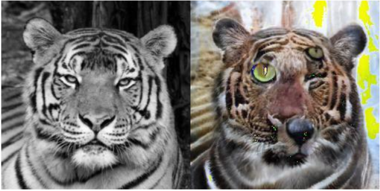

# Colorizing & Cartoonizing-GAN

## Generated Output - Implementation


# Software installation

Clone this repository:
```bash
git clone https://github.com/jaepoong/Colorization-GAN.git
cd Colorization-GAN
```
Install dependency:
```bash
conda create -n Colorization-GAN python=3.6.7
conda activate Colorization-GAN
pip install requirments.txt
conda install pytorch torchvision torchaudio cudatoolkit=11.3 -c pytorch
```


# Datasets 
## AFHQ
I provide a script to download afhq datasets. The datasets will be downloaded to the `data` directories.\
In this code, I used AFHQ for Colorizing

<b>AFHQ.</b> To download the [AFHQ](https://github.com/clovaai/stargan-v2/blob/master/README.md#animal-faces-hq-dataset-afhq) dataset run the following commands:
```bash
bash download.sh afhq-dataset
```
<p align="left"></p>

## Landsacpe
In this code, I used Landscape for the original image of cartoonizing\
<b>Landscape.</b> To download the Landscape Dataset please click the below link

<b>[Kaggle Landscape Dataset](https://www.kaggle.com/datasets/arnaud58/landscape-pictures)<b>
<p align="left"></p>
  
## Cartoon Dataset
For cartooning target Dataset, I made cartoon dataset by the below code\
If you want to make a custom dataset, please implement below code after download video.
This code split the video by frame.
```bash
python video_save.py
```
By Copyright, I cant publish the Cartoon dataset. If you don`t have one, I recommend useing the upright code.
In the implementation, I used the 4500 Shinkai Makoto movie frame dataset. 
  
*example*
<p align="left"></p>
  
## Generate Interpolation
After downloading dataset, you can train Networks by below implementation.\
This code have two kinds Network *Base* and *Modified\
*Base* model consists of U-Net architecture that is inferior than Modified model\
*Modified" model changed a lot, including instance norm, Wgan loss etc.

*example for train Modified "
```bash
 python Gan_main.py --Mod True --model_save_path checkpoints/CycleGAN/ \  ## --model_save_path : save checkpoint at this directory
                    --cartoonizing True \ ## if true, dataloader receive img and target img dir else img become gray scaled of target img
                    --generated_image_save_path \ ## --generated_image save_path is the directory that save generated image each epoch
                    --photo_img_dir \ ##img directory path
                    --photo_image_target_dir \ ## target image dir path
                    --initialization_epochs \ ## for stable training, initialize small epochs for train Generator
                    --num_epochs \ ## i trained colorizing 50 epochs for AFHQ datset
                    --batch_size \ ## in 12GB vram, i used 6 epochs
```
  
## Evaluation metrics
### FID
After training, for evaluating the performance of the generating model, You can evaluate the Frechet Inception Distance(FID) the below code.\
FID evaluates fidelity and diversity of output of the model. (lower = good)\
In this implementation, Because of many parameters, The FID of base model is a little good than Modified model.

```bash
  python metrics/fid.py --paths path1 path2 ## --paths argument need two path for evaluate  
```
  
|FID|Colorizing|Cartoonizing|
|:---:|:---:|:---:|
| |AFHQ Dataset|Cartoon & Landsacpe Dataset|
|Base Model|15.7|90.6|
|Modified Model|16.9|91.7|

  
### Human evaluation  
In this implementation, after training, because Base FID perfomance was better than the Modified model, I surveyed the performance of generated images. \
Despite many artifacts in the base, the Low FID of the Modified model was not reliable. \
So I surveyed output-image by approximately 70 people. \
The result shows Modified model has high performance for human. 
<p align="left"></p>

## Additional experiments

### Affine transform
To test the model invariability, I implemented affine transform for cartoonizing.\
It show that the Modified model is invariant for affine transform(rotation, cropping, etc)
<p align="left"></p>
  
### Degradation
At first, I made the same parameter for each base and Modified the model.\
The performance of the base model was too inferior. The result is below.
<p align="left"></p>
  
  

## Comment
This implementation is colorizing & cartoonizing by two models.\
By this code, the User can easily train the nice model for the 256 resolution style transfer model.\
If any questions, please contact tjfwownd@naver.com or issue
